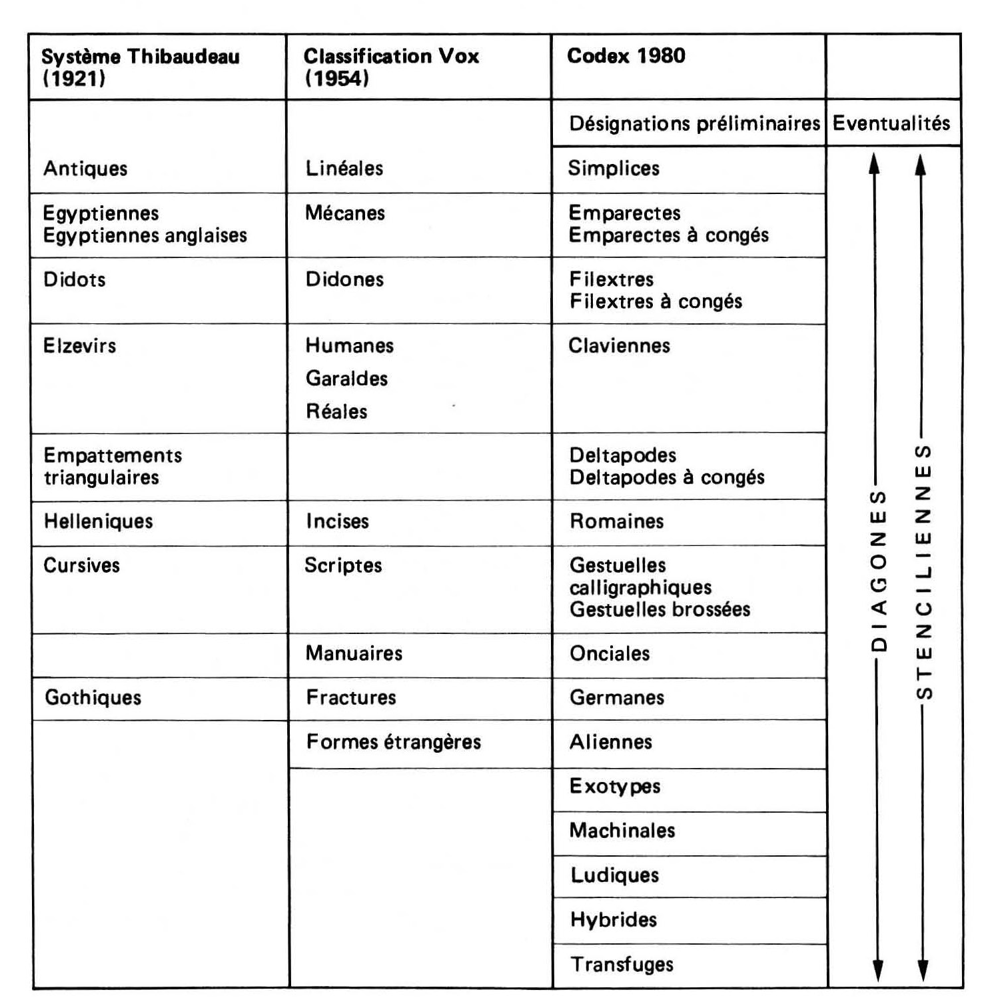
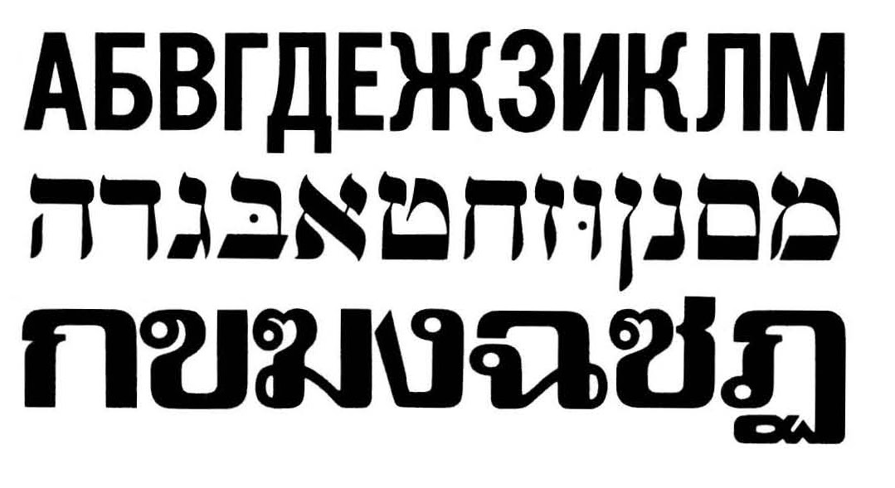

---
title: Codex 1980
...

# Une nouvelle classification typographique : le Codex 1980
*par Jean Alessandrini*

-----------

**La dernière tentative de classification typographique date de vingt-cinq ans;
elle était due à Maximilien Vox. C'était l'époque où l'on clamait à Lurs
la «mort de Gutenberg», où l'on se préparait au remplacement de la
composition plomb par la photocomposition. Le plomb est mort; mais la
grande révolution n'est pas venue de la photo mais de l'informatique...
et de l'adaptation d'un modeste jeu enfantin: la décalcomanie, mère du
lettrage-transfert. Car c'est ce dernier procédé qui a véritablement libéré
la lettre, permettant presque à chacun d'innover pour le meilleur... et pour
le pire. Personne n'avait prévu cette émancipation, cette explosion des
standards typographiques; pas même Maximilien Vox, et sa classification
en témoigne. À temps nouveau donc, classification nouvelle. Il fallait la
fougue, et même une certaine inconscience... et la grande compétence de
Jean Alessandrini pour relever ce défi et nous proposer un nouveau cadre
de référence et une nouvelle terminologie adaptés à nos temps changeants.
C'est fait. Voici le Codex 1980 d'Alessandrini.**

------------

Le Codex 1980 dont il sera question ici consiste en une série
de dispositions nouvelles touchant à la terminologie
typographique. Il a donc, entre autres ambitions, celle de présenter
cinquante-huit ans après Thibaudeau et vingt-cinq ans après
Maximilien Vox, une classification se voulant à la fois plus
juste, plus complète et — sans grand mérite — plus adaptée à
notre temps.
Il se compose de six listes — la première, dite «de
désignations préliminaires», les cinq autres, «de renseignements
d'appoint» — desquelles le typophile pourra prélever par
opérations successives. toutes les informations qu'il jugera utile à la
définition d'un caractère.
Il va de soi que je ne me serais jamais attelé à une tâche de
cette envergure, tâche d'autant plus ingrate qu'elle prêtera sans
doute le flanc aux plus vives critiques, si les classifications
préexistantes (surtout les deux principales évoquées plus haut) me
satisfaisaient pleinement. Or, il n'en est rien, et j'oserai même
dire, au risque de choquer, que je les conteste au point de
vouloir, d'une part, leur substituer mes propres dénominations,
et, d'autre part, en instaurer de nouvelles dont l'absence, à mon
avis, se fait aujourd'hui gravement sentir.
Une nouvelle classification typographique : Codex 1980
Toute  vanité  mise  à part, mon travail typographique passé
m'autorise ce remodelage, et le libéralisme bien connu de notre
profession quant à l'expression de thèses originales me fait un
devoir d'en communiquer les grandes lignes. Ce que je ferai
ici.

### Contestation du système Thibaudeau

Je conteste le système Thibaudeau pour las quatre raisons suivantes :

1. Les caractères qu'il est convenu de regrouper depuis 1921 sous l'appellation générique d'Antiques n'ont d'antique que le
nom.
2. Ceux qu'il est convenu de nommer Égyptiennes n'ont pas grand chose d'égyptien.
3. La raison pour laquelle le terme Elzévir serait censé recouvrir la totalité des caractères à empattements triangulaires ne
m'apparaît pas aveuglante.
4. Conférer enfin au seul Didot le soin de définir l'intégralité des lettres à empattements effilés me paraît relever d'un
nationalisme singulièrement restrictif.

Cette dernière objection est d'ailleurs tout aussi valable pour
les Didones (classification Vox), néologisme aux relents
carthaginois qui, bien que se voulant d'un nationalisme élargi à notre
sœur latine (ne résulte-t-il pas de la contraction de Didot et
Bodoni ?) ne fait, maigre progrès, que recouvrir deux caractères
au lieu d'un, alors que cette famille s'enrichit de centaines de
spécimens !

Et puisque nous parlons de la classification Vox (1954),
venons-y. Mais venons-y à pas feutrés, car je n'ignore pas que
nombreux sont ceux — que par une dérision toute amicale
j'appelle les adorateurs du Vox d'or — qui y tiennent comme
à la prunelle de leurs yeux.

### Contestation de la classification Vox

(comme de toute classification « simplifiante »)  

Pour ce qui concerne le terme de Linéale, astucieusement bricolé pour remplacer les bonnes vieilles Antiques; je concède que le mot est agréable et parlant, mais je ne peux m'empêcher de le trouver de surcroît un rien vague ! Sa racine de linea —
la ligne — , ne le prédispose-t-elle pas à recouvrir des types de lettres totalement étrangers aux caractères-bâton ?
« Pas moins contestable m'apparaît le substantif Mécane adopté en lieu et place d'« Egyptienne »... Et tout aussi gratuit d'ailleurs, car s'il existe de fait certains caractères, à empattements rectangulaires conférant aux signes qu'ils assoient un côté assurément mécanique, d'autres: familles fort dissemblables peuvent également s'en prévaloir.

Je ne souhaite pas pour l'instant me livrer plus avant à une
critique point par point de l'estimable — en son temps —
classification Vox, mais je me propose de la reprendre plus
tard, dans le contexte de la rubrique « Nouvelles dénominations
familiales », ne serait-ce que pour en comparer les composants
avec ceux de la mienne propre.

Car le reproche essentiel que je formule à rencontre des
classifications préexistantes ne réside que fort peu dans ce genre
de détails qui ne prêtent qu'à arguties mondaines pour
graphistes en mal de conversation. 

Bien plutôt, il m'intéresse de remettre en question le principe
même qui en est à l'origine : celui d'une simplification outrancière
! Qui donc a en effet décrété que la simplification en
matière de typographie était une vertu cardinale ?
A notre époque, où ce domaine s'enrichit chaque jour de
nouveautés (prolifération que Vox ne pouvait assurément pas
prévoir, quoiqu'il élaborât sa propre classification à partir d'une
réflexion identique), comment peut-on encore ramener ce
véritable univers de formes à un répertoire mesquin d'une dizaine
de familles ? 

On m'objectera la nécessité qu'il y a de se montrer concis, tant
au niveau français qu'au niveau international. Certes, cette
obligation existe, et je ne suis pas moi-même apôtre d'une
complication excessive qui ne serait finalement qu'un
glissement vers un autre extrême. Ma conviction est toutefois qu'il
existe un moyen terme raisonnable, et ce Codex ambitionne de
le représenter. 

J'étayerai mon propos par une référence analogique : De quelle
façon procèdent les spécialistes traitant d'autres matières au
moins aussi riches que la typographie ?
Les zoologistes par exemple, pour ne citer qu'eux, se
contenteraient-ils de proclamer que la vache, la baleine et le castor sont
des mammifères, en s'arrêtant brutalement à ce trait commun ?
N'approfondiraient-ils pas le sujet en ajoutant que la première
est un ruminant, la deuxième un cétacé, le troisième un
rongeur ? Et je ne parle là que de renseignements élémentaires
susceptibles d'être fournis par un zoologiste du dimanche... Le professionnel averti préciserait, quant à lui, que la vache fait de surcroît partie des bovidés artiodactyles et cavicornes, que la baleine pourrait fort bien prétendre au titre enviable de mysticitus, japonica, antipodum ou marginata, que le castor enfin aurait tout loisir de posséder entre autres prérogatives, celles d'être fiber, chalicomys, sténéogiber ou même trogonthérium !
Je conçois bien que l'inconscient qui se hasarderait à transposer un tel verbiage à la typographie passerait sans recours pour un
abominable cuistre , mais cela posé, pourquoi devrions-nous
repousser comme la peste le jeu des genres et des sous-genres
dès lors que le besoin s'en ferait sentir, cela bien entendu à
l'aide des mots les plus simples?
Nous autres, typographes, typophiles, voire typomanes, spécialistes
par définition, sommes-nous donc tellement inférieurs aux
zoologistes, géologues, paléontologues, etc.? et devrions-nous
nous contenter de dire encore longtemps que le Clarendon , le
Graph-Lubalin, le City ou le Pro-Arte relèvent tous de l'ordre des
Mécanes - terme déjà contestable - sans apporter le moindre
complément d'information ?
Poser la question, c'est en même temps y répondre, et la
réponse s'appelle Codex 1980.

## Codex 1980 désignations préliminaires

### Nouvelles dénominations familiales

Tout d'abord, au vocable trop flou - et comme on l'a vu, gratuit
- de Linéale, je préférerai celui de SIMPLICE pour des raisons
qui apparaîtront à l'évidence (les caractères concernés ne sontils
pas à la fois simples et lisses 7). Un moment, j'ai été tenté
par le terme « Sans empattements », traduit littéralement de
l'anglo-saxon « Sans Serifs », mais la nature privative de
cette appellation me dérangeait. N'est-il pas hasardeux de définir
une chose avant tout par ce qu'elle ne possède pas 7
A l'appellation Mécane, je substitue celle d'EMPARECTE (résultat
du croisement des deux mots qui définissent on ne peut
mieux cette catégorie : EMPAttement et RECTangulaire).
Les caractères à empattements triangulaires relèveront de la
famille des DELTAPODES (pieds en delta).
Quant aux Didots, Bodoni, Walbaum et consorts, ils ressortiront
tout naturellement désormais au groupe des FILEXTRES (extrémités
en fil).

*Nota*

Concernant les trois dernières familles citées, je n'hésiterai pas
à leur accoler l'expression « à congés », directement empruntée
au vocabulaire des architectes, lorsque les empattements des
lettres considérées seront amenés par un arrondi.

Passons maintenant au problème épineux - mais dorénavant
sans objet du fait des règles nouvelles édictées par ce Codex
- soulevé par la dispersion des Humanes, Garaldes et Réales
au sein de la classification Vox.
Ce problème, je le résous par une mesure simplificatrice -
une fois n'est pas coutume - en regroupant ces trois familles
sous une même houlette: celles des CLAVIENNES, ainsi nommées
parce que les empattements caractéristiques de ces dernières,
suggèrent assez fidèlement je crois, l'image toute banale
d'une tête de clou.

Je m'empresse d'ajouter, pour rassurer le nostalgique voxien
qui contesterait, à bon droit - c'est bien son tour -, la précision
toute relative de cette disposition nouvelle, que celui-ci
aura toute possibilité d'approfondir les caractéristiques intrinsèques
ainsi que la localisation temporelle de toute Clavienne en adjoignant à cette désignation préliminaire une ou plusieurs
épithètes appropriées . A cette fin, il se référera utilement aux
listes de renseignements d'appoint intitulées: « repères historiques
» et « considérations esthétiques et de style ".

Mais revenons au répertoire de base .
Les Incises de Vox, jadis Helléniques chez Thibaudeau, deviennent
ici les ROMAINES.
Les Scriptes , elles, se transforment en GESTUELLES, et je
n'hésiterai pas, là non plus, à accoler à ces dernières la dénomination
complémentaire qui s'impose. Comment oserait-on en
effet faire voisiner au coeur d'un même groupe des individualités
aussi différentes que l'Anglaise ou le Mistral? La première sera
donc appelée Gestuelle calligraphique, la seconde Gestuelle
brossée.

Pour ce qui est des Manuaires, dénomination que je juge par
ailleurs tout à fait ahurissante — la plupart des caractères
excédant cette catégorie n'ayant pas été que je sache façonnés
autrement qu'à la main ! — , je soumets à l'approbation générale
la dénomination pure et simple d'ONCIALES. quitte à ce qu'on sa
reporte là encore à la terminologie d'appoint pour plus ample
informé.
En référence à la classification internationale concernant les
Fractures. (qu'en France nous appelons Gothiques), mon
pragmatisme me fait une obligation d'admettre l'arrière-plan culturel
persistant qui les a sans doute pour longtemps frappées de
« germanité ». Je les ai donc baptisées tout simplement GERMANES.
Me référant de nouveau à la classification internationale, je dirai
que je n'ai rien contre l'appellation globale de «formes
étrangères » pour définir les caractères non latins. Je préférerais
néanmoins à ces deux mots un seul vocable, celui d'ALIENNES,
pour peu que l'on s'attache là aussi à préciser nommément leur
origine (Cyrillique. Hellénique. Chinoise, Nippone, Hébraïque,
etc.).

Dans un ordre d'idées voisin — et ceci constituera une excellente introduction à la rubrique suivante — , je préconise la
création de. la famille EXOTYPE, laquelle regroupera les caractères de forme latine, mais dont le dessin est ouvertement
influencé par une graphie étrangère n'utilisant que peu (cyrillique) ou pas du tout (chinois) notre code alphabétique. Là
encore, on n'omettra pas de préciser la contrée originelle par un qualificatif d'appoint.
Et puisque je parle de la création de familles nouvelles, en voici maintenant d'autres dont l'instauration n'a, à mon avis, que
trop tardé.

Le Priam
Exotype hellénique
Néo-archaïque,
brisée, juxtaposable, combinatrice
(Hollenstein phototypo)

### Exotypes, Machinales, Ludiques, Hybrides, Transfuges

*Cinq nouvelles familles issues du « dépotoir. »*

Depuis une vingtaine d'années, avec l'apparition de techniques
nouvelles (phototitrage, lettres-transfert...), on a assisté à
l'apparition, timide au début des années 1960, puis à la prolifération au
cours de la décennie 1970, de caractères de titrage qui rendirent
malades les puristes — parfois légitimement — , mais permirent
à toute une jeune génération de graphistes de s'exprimer. Pour
la France, nul ne contestera à l'enthousiaste Albert Hollenstein
d'avoir été l'artisan principal de ce bouillonnement créatif, en
même temps que le promoteur de formes typographiques
originales.

Sans vouloir porter ici de jugement de valeur sur tel ou tel
caractère en particulier, on peut estimer rétrospectivement que
ce mouvement entraîna dans son1 sillage son lot d'innovations
spectaculaires, de découvertes intéressantes, de trouvailles
astucieuses, mais aussi et surtout, convenons-en; son -excès
d'innomables ratages.

Pris de cours dès l'origine par ce foisonnement, les
professionnels (imprimeurs, graphistes, directeurs artistiques et autres...) .
regroupèrent d'un accord tacite ces nouveautés sous
l'appellation générique de FANTAISIES, appellation quelque peu hâtive à
mon sens, et de toute façon péjorative, eu égard à l'excellence
de certains travaux. Et l'on s'en tient là.,
C'est, ainsi qu'aujourd'hui encore certains catalogues, affichant
des caractères aussi dissemblables que le Mirago, le Glaserstencil
ou l'Alessandrini 7, font cohabiter ces derniers dans la
même rubrique-dépotoir dont la, dénomination même est enta-^
chée de frivolité : Fantaisies !

Afin de couper court à cette malédiction arbitraire, je propose
donc l'instauration de cinq familles nouvelles, chacune déjà
suffisamment riche d'éléments divers, quoique regroupant assez
de traits communs, pour prétendre à un voisinage à part entière
au côté des Simplices, Emparectes et autres Deltapodes.
J'ai parlé plus haut des Exotypes. Je ne m'étendrai donc pas
outre mesure sur ce groupe si ce n'est pour observer que ses
éléments existent en plus grand nombre aux Etats-Unis qu'en
Europe à l'état d'alphabet.

Pour la France, on peut toujours citer le Priam.'dont la fiche
d'identité complète suivant le Codex pourrait être celle-ci:
Priam Exotype hellénique néo-archaïque brisée, juxtaposable, combinatoire
Il va bien entendu de soi que l'utilisateur profane — et
souhaitant le rester — pourra se limiter aux deux premières
considérations.

Avec plus d'importance encore, à mon avis, s'impose aujourd'hui
la famille des MACHINALES. Sous cette bannière se retrouvent
ce qu'il est convenu d'appeler les « caractères d'ordinateur»,
Machinales computrices selon le Codex. Ces dernières,
épaulées par leurs soeurs,. Machinales cathodiques, jouent déjà un
rôle déterminant au coeur de la grande révolution technologique
contemporaine. La mention de leur existence dans une
classification qui se veutsérieuse me paraît donc indispensable ; ces
écritures robotisées ne sont-elles pas aussi spécifiques de
notre xxe siècle finissant que les Lapidaires. le furent de
l'Antiquité romaine, les Onciales, du temps des manuscrits, les caractères à
empattements, de l'âge du plomb, et les Simplices, de celui du film ?
Cousines de ces .dernières, les Machinales modulaires
désignent, quant à elles; les caractères dont le dessin a été élaboré
à partir d'un module de base rigide.

La troisième famille dont je préconise l'adoption recouvre une
foule de caractères fort dissemblables dans leur .esthétique,
mais proches par leur finalité, et qui sont très probablement à
l'origine de la dénomination peu flatteuse de Fantaisies, terme
qui englobe abusivement la totalité des caractères inclassables
jusqu'ici.
Je les ai, quant à moi, répertoriés sous la seule appellation de
LUDIQUES. L'utilisateur scrupuleux du Codex aura toutefois le
loisir d'affiner cette « Iudicité » en consultant les cinq listes de
renseignements d'appoint dont j'ai parlé, et en lui accolant le
(ou les) qualificatif(s) qu'il jugera appropriés.
Comme leur, nom le laisse entendre, les Ludiques sont des
caractères de divertissement. Ils peuvent se présenter sous la
forme d'ensembles astucieux, de groupes de lettres combinatoires,
de suites dessinées favorisant les jeux optiques, de
signes illustrés, etc.
Assurément ce ne sont pas, ce ne seront jamais des Lecturiennes
(nouvelle dénomination des caractères-labeur — voir
ce mot — ), mais, leur lisibilité est aussi tellement aléatoire
qu'on pourra même discuter à certaines de prétendre à un rôle
dans le titrage, si ce n'est à très. faible dose.
Pour ma part, je ne mépriserai certainement pas les Ludiques.
D'abord parce que j'en ai moi-même dessiné et. qu'aujourd'hui
encore,. je suis loin de les considérer comme des erreurs de
jeunesse, mais aussi et surtout, parce que je pense qu'elles
constituent une excellente base d'initiation pour les étudiants
en art graphique, trop souvent découragés par l'aspect
rébarbatif des cours de dessin de lettre.

J'ai regroupé dans l'avant-dernière catégorie, celle des HYBRIDES,
certains types de lettres jusqu'alors inclassables , dans
la morphologie desquelles on peut déceler des traits propres
à deux, trois ou même quatre familles bien distinctes.
Comme exemples patents d'hybridité, je citerai:

— le Tangent; le Ligérien, le Dynamo, tous trois résultant d'un
croisement Simplice x Emparecte ;
— le très intéressant Mendoza, au sujet duquel l'observateur
attentif peut déceler une double provenance Simplice x Romaine
(cela apparaît d'ailleurs comme une constante dans l'oeuvre de
Mendoza) ;
— l'étrange Siris d'Albert Hollenstein, lui aussi hybride
Simplice x Emparecte, mais qui pousse la singularité jusqu'à être
partiellement Stencilienne (voir ce mot).
Et s'il reste encore des sceptiques quant à l'opportunité
d'inaugurer ce groupe, je me permettrai de soumettre à leur perplexité
ces deux véritables ornithorynques typographiques que sont le
Corvinus et le Quirinus...

Famille voisine de la précédente, voici maintenant celle des
TRANSFUGES, dont la création a, entre autres mérites, celui
d'apporter une solution définitive à un problème exaspérant. De
fait, quel amateur de classements tant soit peu rigoureux ne
s'est-il jamais heurté au casse-tête qui consiste à définir sans
ambiguïté tel ou tel caractère que sa version maigre cantonnerait
à l'évidence dans une famille bien déterminée, mais que
les séries grasses et extra-grasses apparenteraient non moins
évidemment à une autre?
Prenons le cas du Korinna. Dans sa version maigre, aucun doute
possible: nous avons affaire à une Clavienne. Jetons à présent
un coup d'oeil à sa version heavy, la voilà devenue Emparecte
à congés, ses empattements, légers à l'origine, ayant engraissé
avec l'alourdissement général.
La définition de ce Fregoli typographique se fera désormais sans
équivoque : Korinna : Transfuge/Clavienne-Emparecte.

### Le cas particulier des Diagones et des Stenciliennes

1. Les Diagones
Italiques ... Là encore, au risque de passer pour excessivement
tatillon, je contesterai l'opportunité du terme (qui ne doit cette
fois rien à Vox), l'origine italienne de cette variante n'étant pas
à mon avis décisive pour caractériser toutes les lettres penchées.
Je conseillerai, en outre, à ceux qui désirent s'aggriper à cette
localisation péninsulaire , d'adopter plutôt le terme de Pisane, en
référence à la fâcheuse inclinaison de la célèbre tour! Mais
soyons sérieux ... Tout conscient que je suis d'être dans la situation
de celui qui voudrait abattre une bastille plusieurs fois
centenaire à l'aide d'un canif, je propose de substituer en lieu
et place du très peu fondé cc italique» le néologisme à la fois
plus évocateur et plus juste de Diagone.

Le typophile scrupuleux pourra même, s'il le juge utile, se
hasarder à parler dans certains cas extrêmes de mini-Diagone
(Eras) de maxi-Diagone (BusterJ, voir même d'anti-Diagone pour
les quelques alphabets égarés présentant une oblique inverse
à la normale convenue.

2. Les Stenciliennes
Sous ce vocable inédit, sont réunis tous les caractères-pochoir
(en anglais stencil) ou découlant du pochoir.
Le professionnel de la lettre s'étonnera sans doute; de voir
cohabiter.au sein d'une même rubrique deux catégories aussi
peu analogiques que les Diagonese et les Stenciliennes. Il y a
cependant une bonne raison à cela : les deux familles possèdent
le point commun non négligeable de concerner potentiellement
la totalité des familles recensées plus haut.
Cette qualité éminente autorise chacune (parfois les deux à la
fois, car il existe des Diagones-Stenciliennes) à intervenir, à
titre de renseignement tout aussi prioritaire que la désignation
familiale préliminaire elle-même. C'est ainsi que parlant par
exemple du Glaser-Stencil, ou du Charette, on pourra dire du
premier qu'il est une Simplice-Stencilienne, et du second qu'il
est une Filextre-Stencilienne.
Cette dénomination familiale pourra même parfois se suffire à
elle-même pour déterminer l'appartenance d'un caractère. Le
Futura-Black, par exemple, qui est une Stencilienne pure, ne
nécessitera l'appoint d'aucune autre désignation préliminaire
pour, définir sa typologie.
Pour être tout à fait précis, le terme de Stencilienne s'applique
à tous les caractères dont les; signes présentent un dessin
interrompu, haché, voire partiellement escamoté. Et, c'est justement cette dernière, appréciation qui confère une importance
capitale à ce groupe particulier.

Je soutiens, en effet, que c'est dans la silhouette de certaines
Stenciliennes qu'est contenu le germe de ce qui deviendra. sans
doute la graphie latine du siècle prochain.
Si l'on spécule en effet sur une simplification progressive de
leur construction jusqu'à la suppression pure et simple
d'éléments de dessin rendus définitivement caducs par les habitudes
de lecture, il n'est pas déraisonnable d'envisager l'avènement
d'un nouveau type de lettre que l'on pourrait d'ores et déjà
nommer Stencilienne ultra-Simplice. Il n'est pas interdit de
penser, que, par la suite, d'autres familles que la Simplice
emprunteraient ce même chemin.
Certains de ces alphabets initiateurs de la nouvelle espèce
sont déjà parmi nous, de, nombreux. graphistes hantés par
l'esthétique future  de la lettre s'étant déjà penchés sur le
problème, à commencer par Cassandre avec son prophétique
Bifur.
Mais il y eut depuis l'élégant Tanagra d'Albert Boton, l'astucieux
Glaser-Stencil de Milton Glaser, le curieux Flora, d'Ulrich Meyer,
sans oublier le Futuriste, que je dessinai en 1967 et sur lequel
je laisserai le soin à d'autres de porter un jugement de valeur.

### Contestation de la terminologie typographique traditionnelle

Si je me hasarde à proposer aujourd'hui ce répertoire de
définitions substitutives ou complémentaires, c'est: parce que j'ai
estimé que le besoin en était devenu impérieux," compte tenu
de la précision toute relative des précédents systèmes de
classement.
Parvenu à ce point de mes critiques et de mes propositions,
j'approfondis ma réflexion,, et -me dis que tant qu'à vouloir
changer les choses dans un. sens. que j'aime « à «croire positif,
autant plonger plus profondément encore.au. coeur de la
typographie afin de dépoussiérer un, domaine inviolé depuis les
origines: C'est ainsi que j'attaquerai sans le. moindre complexe
des expressions aussi démonétisées que capitales et bas de
casse. J'entends déjà crier au scandale., Pourquoi ? Suis-je donc
sacrilège de considérer ces deux, termes comme obsolètes?
car qu'on le déplore ou non, les casses ont une certaine
tendance à disparaître... En outre, je les trouve absurdes, et cela
d'entrée de jeu : s'il existe des bas de casse/pourquoi cette
appellation de capitales au lieu de hauts de casse.?
Je ne suis pas pour les compromissions avec le vocabulaire
profane, il me semble l'avoir prouvé, mais j'estime que ce ne
serait pas déchoir que d'employer comme tout un chacun des
termes aussi simples que majuscules. et minuscules. Le fait
qu'ils soient 'intelligibles par le plus grand nombre n'entache
en rien leur exactitude, et, pour ma part, je les adopte bien
volontiers.
Je n'épargnerai pas davantage les - « caractères de . labeur »,
groupe de mots lourd et antédiluvien, en lieu et place desquels
je préconise l'adoption d'un vocable simple et parlant, mais
qui ne doit rien cette fois au langage de tous les jours : celui
de LECTURIENNES.
Axiome: Il va de soi que si toute Lecturienne peut être
considérée de surcroît comme caractère de titrage, l'absence de cette
mention qualitative dansla définition d'un alphabet cantonnera
celui-ci au seul titrage.

	-----------------------------------------------------------------------------
	|	Terminologie traditionnelle 	| 	Nouvelles désignations Codex 1980	|
	-----------------------------------------------------------------------------
	|	Capitales 						|	Majuscules							|
	|	Bas de casse 					|	Minuscules							|
	|	Caractères de labeur 			|	Lecturiennes						|
	|	Italiques 						|	Diagones							|
	|	caractères-pochoir				|	Stenciliennes						|
	-----------------------------------------------------------------------------

## Les cinq listes de renseignements d'appoint

### 1. Liste des considérations formelles objectives

Cette liste se compose d'une suite de qualificatifs pouvant
aider à la définition d'un caractère. Certains d'entre eux sont
connus et appartiennent déjà à la terminologie typographique
usuelle (maigre, grasse, demi-grasse, éclairée, etc.). Les autres
ont été relevés par mes soins à la suite d'un grand nombre
d'observations (juxtaposable, combinatoire, à circuit(s), à section
emboulée, etc.). Leur utilisation ne s'impose pas moins
si l'on veut obtenir une définition affinée.
Quoique se voulant la plus complète possible, cette liste ne
saurait bien entendu prétendre à l'exhaustivité. Le typophile
aura par conséquent toute liberté de combler les manques,
présents et à venir, au moyen des termes qu'il jugera nécessaires
d'employer - pourvu que ceux-ci soient précis et clairs et qu'ils
ne figurent pas déjà dans la liste à l'état de synonymes.

### 2. Liste des repères historiques

Cette chronologie s'efforce d'embrasser toutes les périodes
marquantes de l'histoire humaine, c'est assez dire qu'elle ne
sera pas plus exhaustive que la précédente.
Elle comprend une liste de mots dont le choix aidera s'il y a
lieu à localiser historiquement un caractère donné. Son utilité
est évidente notamment dans le cas des Claviennes (Humanes,
Garaldes et Réaies de la classification Vox) qui pourront
devenir selon les occasions Claviennes-Médiévales,
Renaissance, Grand-Siècle, Modernes, etc.

### 3. Liste des considérations esthétiques et de style

Corollaire de la liste n° 2, cette compilation propose une série
de renseignements d'appoint, relatifs aux tendances artistiques
durables ou éphémères qui influèrent sur le dessin de la lettre
aux époques mentionnées plus haut.
Nota. L'utilisateur ne devra pas reculer devant l'emploi des
préfixes « néo » et « pseudo », chaque, fois que ces précisions
lui sembleront opportunes,' en particulier dans le cas des
alphabets de style rétro.

### 4. Liste des considérations formelles subjectives (et donc « complétable » à merci)

Là encore, une suite d'épithètes sélectionnées en fonction du
sentiment immédiat inspiré par l'observation de nombreux
alphabets.
Si certaines de ces appréciations peuvent paraître discutables,
du fait précisément de leur caractère subjectif (excessives,
sévères, emphatiques, etc.), d'autres en revanche me paraissent
plus évidentes, « rythmiques », par exemple, et que l'on pourra
notamment employer dans le cas de certaines . Gestuelles-
Calligraphiques portant des noms . révélateurs d'une flagrante
connotation musicale (Stradivarius, Rhapsodie, Virtuosa, Vivaldi,
etc.).

### 5. Localisations géographiques et précisions originelles

Cette dernière liste concerne prioritairement deux familles
bien définies : les Aliennes et les Exotypes. Elle comporte
elle aussi son lot de qualificatifs, mais ceux-ci se réfèrent
cette fois aux. contrées dont le signe est issu (Aliennes), ou
dont le folklore sémiotique a influencé la graphie du caractère
latin considéré (Exotypes).
Il va de soi que ce répertoire n'est nullement limitatif;
j'ajouterai même que les possibilités d'improvisations sur ce thème
de la part de l'utilisateur me paraissent assez étendues, compte
tenu d'engouements touristiques toujours possibles.

Hébraïque
Cyrillique
Chinoise
Nippone
Hindoue
Birmane |
Thaï
Celtique
Gaélique
Runique
Saxone
Gothique |
Arabique
Persane
Maghrébine
Western |

## Conclusion

Je ne suis pas naïf au point de croire à une quelconque adoption
ou ratification de mon : Codex, quoique je m'emploierai à
atteindre ce but toutes les fois que cela me sera possible.
Pourquoi d'ailleurs me bercerais-je d'illusions quant à sa
destinée, lorsque je constate que la classification de Maximilien Vox,
créée il y a un quart de siècle, entérinée en son temps par les
grands pontifes de l'époque et de surcroît universellement
agréée, n'est pratiquement jamais, utilisée dans la pratique.
Convenons, en effet, que par paresse, par habitude ou même
par crainte d'être mal compris, nous continuons à appeler
Antiques et non Linéales les caractères-bâton, que nous
méprisons allègrement les Mécanes au profit des Egyptiennes, et que
nous ignorons superbement les Humanes, Garaldes et autres
Réaies, pour ne parler que d'EIzévirs...
Je suis donc parfaitement conscient de la nature quelque peu
aléatoire de la tâche à laquelle je me suis attelé et dont on
vient de lire l'essentiel dans cet article. Mais ce
désenchantement s'explique par une autre raison autrement plus formidable
que l'indifférence prévisible du microcosme graphique, ou même
que les critiques constructives ou stériles que certains parmi
les plus passionnés ne manqueront pas de m'adresser : ce Codex
va à contre-courant ! Ne privilégie-t-il pas une denrée, ô combien
périssable en notre époque d'appauvrissement culturel
généralisé, à savoir le vocabulaire, même dans ce que celui-ci peut
avoir d'élémentaire ?
N'est-ce pas folie, en effet, que de vouloir définir à l'aide d'un
néologisme pas bien méchant suivi de trois ou quatre mots
simples et évocateurs, la silhouette d'un signe en un temps
où les mots sont dénaturés, prostitués, et récupérés, quand ils
ne sont pas réduits purement et simplement à l'état d'initiales ?
Un philosophe oriental disait à peu près, je crois, qu'au soir
de sa vie, un homme devait avoir bâti sa maison.écrit un livre,
et confectionné un bouquet. J'ajouterai, pour ma modeste part,
que fort de son expérience, un spécialiste tant soit peu captivé
par la matière à laquelle il a voué une grande partie de son
existence, devrait raisonnablement éprouver un jour ou l'autre
Is besoin de se pencher sur les usages qui la codifient; afin, s'il
y a lieu, d'en contester Jes termes de bonne foi, et de proposer
à l'issue de sa réflexion les modifications et les dispositions
nouvelles qui lui paraissent nécessaires.
C'est à cet exercice périlleux entre tous que je viens de me
livrer. 

Jean Alessandrini

--------------------

*Une nouvelle classification typographique : le Codex 1980.* 
Communication et langages, n°43, 3e trimestre 1979. pp. 35-56.

[Source](http://www.persee.fr/doc/colan_0336-1500_1979_num_43_1_1314)

